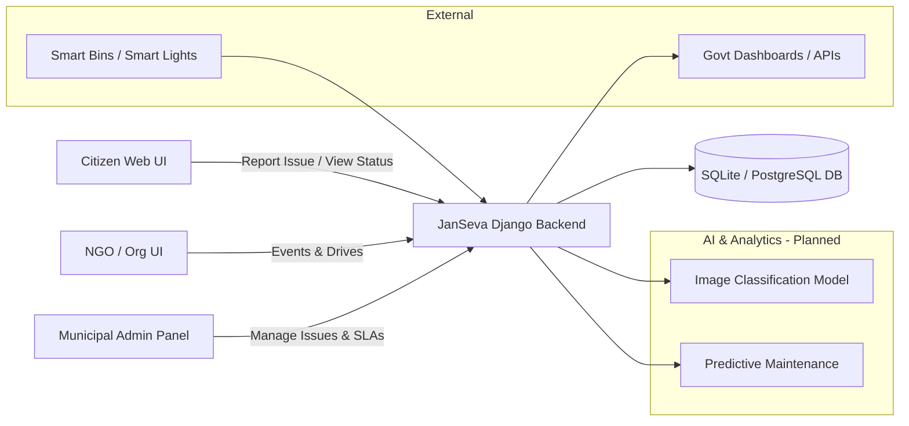

# 🏙️ JanSeva – Smart Civic Issue & Community Engagement Platform

> A smart-city platform that connects **citizens, government bodies, and NGOs** to report, track, and resolve civic issues faster – with AI assistance and actionable dashboards.

---

## 🔍 Problem

Urban citizens struggle with:

- **Fragmented issue reporting** – garbage, potholes, broken lights, water leaks are reported across multiple apps, calls, or not at all.  
- **Zero transparency** – no clear visibility of *who* is responsible or *when* something will be fixed.  
- **Poor collaboration** – municipal bodies, contractors, and NGOs work in silos, leading to delays and duplicate efforts.

Result: **dirty streets, unsafe infrastructure, and frustrated citizens** despite large civic budgets.

---

## ✅ Our Solution – JanSeva

**JanSeva** is a unified civic engagement platform that:

- Lets **citizens report issues** with photos, locations, and language of their choice.
- Uses **AI to auto-classify issues** (garbage, potholes, broken lights, etc.) and route them to the right department.
- Provides **dashboards for government officials** to monitor city health, SLAs, and hotspots.
- Enables **NGOs & community groups** to run and promote cleanliness drives, awareness campaigns, and events.
- Supports **multi-language UX**, making it accessible to diverse citizens.

> One platform for **reporting issues, visualizing city health, and mobilizing community action.**

---

## ✨ Key Features

### 👥 For Citizens
- 📸 **Photo-based issue reporting** with location and description.
- 🏷️ **AI-powered category detection** (garbage, pothole, streetlight, water, etc.) – *planned / in progress*.
- 🌐 **Multi-language interface** for inclusive access.
- 🔔 **Issue status tracking** from *Raised → In Progress → Resolved*.
- ⭐ Feedback / rating system for resolution quality – *planned*.

### 🏛️ For Government & Admins
- 📊 **Centralized admin panel** to view and manage all incoming issues.
- 🗺️ **Ward-wise / area-wise issue mapping** and hotspots – *planned*.
- ⏱️ **SLA tracking** – see which issues are delayed and which team is responsible – *planned*.
- 📥 **Exportable reports & analytics** for review meetings – *planned*.

### 🤝 For NGOs & Community
- 📣 **Events & drives section**  
  - List cleanliness drives, awareness programs, and community events.  
  - Allow citizens to **register / volunteer**.  
  - Show **past & upcoming events**, with impact metrics – *planned*.
- 📝 Issue tags linked to events (e.g., "Cleanliness Drive – Ward 12").

### 🤖 Smart & Future-Ready (Planned)
- 🧠 **AI Issue Detection**: classify civic issues from images and text.
- 📈 **Predictive maintenance**: identify recurring hotspots before they become major problems.
- 🛰️ **IoT integration**: smart bins, smart lights, and real-time status from devices.
- 🔗 **Govt Dashboard API**: expose city KPIs to external systems and dashboards.
- 🌍 **AR-based issue viewing**: point your camera at public infrastructure to check status – *concept stage*.

---

## 🏗️ Tech Stack

- **Backend:** Django (Python)
- **Database:** SQLite (dev) / PostgreSQL (recommended for production)
- **Frontend:** Django templates (with Bootstrap / custom CSS – extendable to React/SPA)
- **AI / ML (planned):** Python-based CV & NLP models for classification and predictions
- **Others:** REST APIs, role-based access (citizen / admin / NGO – planned)

---

## 🚀 Getting Started (Local Development)

### 1. Clone the Repository

```bash
git clone https://github.com/buffer-tech/terna.git
cd terna
```

### 2. Create & Activate Virtual Environment

```bash
# Windows
python -m venv .venv
.venv\Scripts\activate

# macOS / Linux
python3 -m venv .venv
source .venv/bin/activate
```

### 3. Install Dependencies

```bash
pip install django djangorestframework django-cors-headers Pillow
```

Or if you have a `requirements.txt`:

```bash
pip install -r requirements.txt
```

### 4. Apply Migrations

```bash
python manage.py migrate
```

### 5. Run the Development Server

```bash
python manage.py runserver
```

Open the app in your browser at:

```
http://localhost:8000/
```

Available pages:
- Home: `http://localhost:8000/`
- About: `http://localhost:8000/aboutus/`
- Admin: `http://localhost:8000/admin/`
- API: `http://localhost:8000/api/home/`

---

## 📁 Project Structure (High-Level)

```
terna/
├─ Admin/               # Admin-side Django app (configurable)
├─ aboutus/             # About page app with templates and API
├─ home/                # Issue reporting, user registration, API endpoints
├─ JanSeva/             # Core project settings and URLs
├─ issues/
│  └─ before/           # Issue-related views / experiments / legacy
├─ manage.py            # Django project entrypoint
├─ db.sqlite3           # Local development DB (SQLite)
├─ .venv/               # Virtual environment (not committed to Git)
└─ .gitignore           # Git ignore rules
```

---

## 🧭 Core User Flows

### 1️⃣ Citizen – Raise an Issue
1. Open home page.
2. Click "Report an Issue".
3. Fill in details:
   - Title, description, location, category.
   - Upload photo.
4. Submit and get a ticket ID.
5. Track status on "My Issues" page – *planned*.

### 2️⃣ Admin – Manage Issues
1. Log in to admin panel (`/admin`).
2. View list of open issues.
3. Filter by status, ward, category – *filters planned*.
4. Assign to team / department.
5. Mark as *In Progress* / *Resolved* and add resolution notes.

### 3️⃣ NGO / Organization – Create Events
1. Go to Events section – *planned UI*.
2. Create a new event (e.g., "Swachhata Drive – Sector 5").
3. Add date, location, volunteers needed, and linked issues/areas.
4. Citizens can view and register.

---

## 📊 Architecture Overview



---

## 🧪 Running Tests (Optional)

Once you start adding tests:

```bash
python manage.py test
```

---

## 🗺️ Roadmap

- [x] Django project setup
- [x] Basic home / about pages
- [x] Citizen issue reporting form
- [x] Token-based authentication
- [x] REST API endpoints
- [ ] Issue listing & filtering (admin)
- [ ] NGO / events module
- [ ] AI-based issue classification from images
- [ ] Predictive analysis & hotspots
- [ ] Integration with IoT feeds (smart bins, lights)
- [ ] Multi-language support (Marathi, Hindi, English, etc.)
- [ ] Public dashboards and open data API

---

## 👨‍👩‍👧‍👦 Team

| Name | Role | Contact |
|------|------|---------|
| **Prachi Nimbalkar** | Full Stack Developer | [GitHub](https://github.com/collab1) |
| **Sanskruti Sugandhi** | Frontend Developer | [GitHub](https://github.com/sanskruti048) \| [Email](mailto:sanskruti.sugandhi4@gmail.com) |
| **Harsh Pardeshi** | Backend Developer | [Email](mailto:harshvpardeshi@gmail.com) |
| **Pratham Dabhane** | UI/UX Designer | [GitHub](https://github.com/Pratham-Dabhane) \| [LinkedIn](https://linkedin.com/in/pratham-dabhane) |
| **Ritesh Pawar** | Project Manager | [GitHub](https://github.com/collab5) |

---

## 🌍 Impact & Alignment

- Supports **SDG 11 – Sustainable Cities and Communities** by improving urban livability.
- Increases **accountability and transparency** in civic maintenance.
- Empowers **citizens, students, NGOs, and administrators** to collaborate on city problems instead of working in silos.

---

## 🤝 Contributing

This project started as a hackathon prototype and is designed to evolve.

1. Fork the repo.
2. Create a feature branch:
   ```bash
   git checkout -b feature/your-feature-name
   ```
3. Commit and push your changes.
4. Open a Pull Request with a clear description and screenshots (if UI-related).

---

## 📄 License

*License to be decided.*  
We recommend adding a suitable open-source license (e.g., MIT) once the team finalizes it.

---

## 📬 Contact

For queries, suggestions, or collaboration:

- **GitHub**: [@buffer-tech](https://github.com/buffer-tech)
- **Issues**: Use the [GitHub Issues](https://github.com/buffer-tech/terna/issues) tab to report bugs or request features.

---

Made with ❤️ by the **JanSeva / Terna Hackathon Team**.
